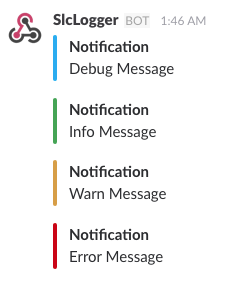

# SlcLogger

[](https://travis-ci.org/iktakahiro/slclogger)

**Simple and Human Friendly Slack Client for Logging Written in Go Programming Language**

## Install

```bash
go get "github.com/iktakahiro/slclogger"
```

## How to Use

### Basic Usage

```go
package main

import (
	"errors"

	"github.com/iktakahiro/slclogger"
)

func something() error {
	return errors.New("an error has occurred")
}

func main() {

	logger, _ := slclogger.NewSlcLogger(&slclogger.SlcLoggerParams{
		WebHookURL: "https://hooks.slack.com/services/YOUR_WEBHOOK_URL",
	})

	if err := something(); err != nil {
		logger.Err(err, "Error Notification")
	}
}
```

When you execute the above sample code, your Slack channel will receive the message.


### Log Levels

The default log level is *Info*. You can set it when initializing a SlcLogger struct.

```go
logger, _ := slclogger.NewSlcLogger(&slclogger.SlcLoggerParams{
    WebHookURL: "https://hooks.slack.com/services/YOUR_WEBHOOK_URL",
    LogLevel: slclogger.LevelDebug,
})

logger.Debug("Debug Message")
logger.Info("Info Message")
logger.Warn("Warn Message")
logger.Err("Error Message")
```



You can also change the level at any time.

```go
logger.SetLogLevel(slclogger.LevelWarn)

// The following notification is ignored.
logger.Debug("Debug Message")
```

### Configure Options

All options are shown below.

```go
logger, err := NewSlcLogger(&SlcLoggerParams{
    WebHookURL:   "https://hooks.slack.com/services/YOUR_WEBHOOK_URL",
    DefaultTitle: "Default Title",
    Channel:      "general",
    LogLevel:     LevelWarn,
    IconURL:      "https://example.com",
    UserName:     "My Logger",
})
```

Param | Default Value
------ | ------------
WebHookURL (*require*) | --
DefaultTitle | "Notification"
Channel | "" (When this param is omitted, the default channel of specified WebHook is used.)
LogLevel | Info
IconURL | ""
UseName | ""

## Error Handling

If you want to handle errors, use SlcErr.

```go
if err := logger.Info("info message"); err != nil {
    if slcErr, ok := err.(*slclogger.SlcErr); ok {
        fmt.Println(slcErr)
        fmt.Println(slcErr.Code)
    }
}
```

## Test

```bash
go test $(go list ./... | grep -v /vendor/ | grep -vE "github.com/iktakahiro/slclogger$");
```

## Documents

- [slclogger \- GoDoc](https://godoc.org/github.com/iktakahiro/slclogger)
